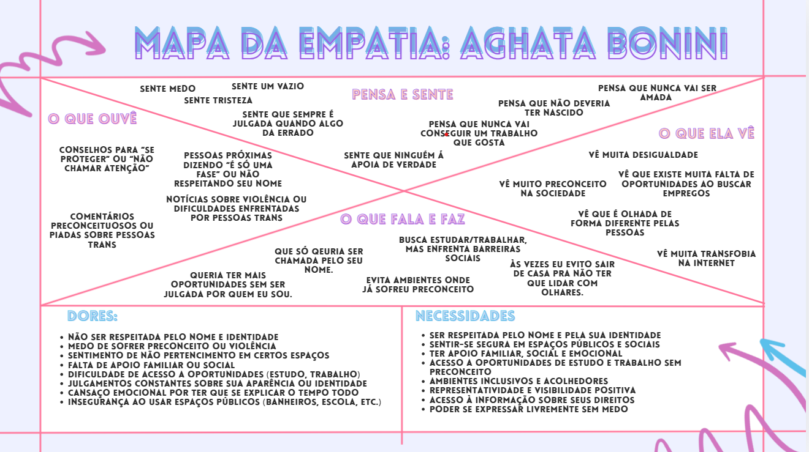

# TransLaço – Projeto Integrador

## Sobre o Projeto
O TransLaço é uma plataforma digital desenvolvida com o objetivo de dar visibilidade à realidade de pessoas trans e travestis, destacando seus desafios, vivências e a importância da inclusão social.

O projeto busca promover informação, respeito e oportunidades, contribuindo para a construção de uma sociedade mais justa e igualitária.

---

## Objetivo
Desenvolver um site acessível voltado à promoção de cursos profissionalizantes, oportunidades de emprego inclusivas e à construção de um ambiente acolhedor, onde pessoas trans e travestis se sintam valorizadas e inseridas no mercado de trabalho formal.

---

## Proposta
Criar uma plataforma digital acessível e informativa, que ofereça:
- Conteúdos educativos  
- Apoio à comunidade  
- Divulgação de vagas de emprego inclusivas  
- Cursos profissionalizantes  

Com foco na inclusão de pessoas trans e travestis no mercado de trabalho.

---

## Desenvolvimento do Projeto

### Investigação do Problema
O projeto foi desenvolvido a partir da análise das dificuldades enfrentadas por pessoas trans e travestis, como:
- Preconceito  
- Falta de oportunidades  
- Exclusão social  

---

### Técnica dos 5 Porquês
Utilizada para identificar a raiz do problema, destacando a falta de informação e inclusão como fatores principais.

---

### Mapa da Empatia (Individual de cada integrante do Grupo) 
Durante a preparação do Mapa da empatia, foi analisado que cada um do grupo colocou algo parecido, como:
- Medo e insegurança  
- Falta de representatividade  
- Exclusão social  
- Busca por aceitação e respeito  

---

### Pesquisa Realizada
- Total de participantes: 36 
- Resultado: a maioria reconhece a existência de preconceito e falta de informação  
 - Foram obtidas 36 respostas, com cerca de 70% dos participantes entre 15 e 18 anos. As demais faixas etárias também aparecem, sendo 13,9% entre 19 e 25 anos, 8,3% entre 26 e 35 anos e uma pequena parcela acima dessa idade, indicando predominância de público jovem na pesquisa.

 - A análise da identidade de gênero mostra que a maioria dos respondentes se identifica como mulher cisgênero (63,9%), seguida por homens cisgênero (33,3%). As demais identidades aparecem com baixa representatividade, indicando que a amostra é majoritariamente composta por pessoas cisgênero, o que influencia a interpretação dos dados sobre a comunidade trans.

 - Diante disso, os dados evidenciam que a maioria dos respondentes é composta por pessoas cisgênero, o que contribuiu diretamente para a percepção do projeto. Essa predominância será fundamental na construção da persona e do mapa da empatia, pois ajuda a identificar possíveis lacunas de compreensão e reforça a importância de representar, de forma mais fiel, as vivências da comunidade trans.

### Mapa da empatia (Feito pelo grupo Geral) + Persona 

- O mapa da empatia da persona Agatha Bonini ajudou a entender melhor sua rotina, sentimentos e desafios. Ele mostra uma jovem determinada, que equilibra trabalho e estudos enquanto enfrenta inseguranças e preconceitos, mas segue firme em busca dos seus objetivos. A análise também evidencia suas dores, como a falta de aceitação, e seus ganhos, como o desejo por respeito e oportunidades. Com isso, o mapa foi essencial para orientar o projeto de forma mais realista e alinhada à sua vivência.

--- 

## Tecnologias Utilizadas
- HTML5  
- CSS3  

---

## Equipe do Projeto
- Willian Baracho  
- Yasmim Faria  
- Ana Matos  
- Sabrina Cardoso  

---

## Ano
2026
